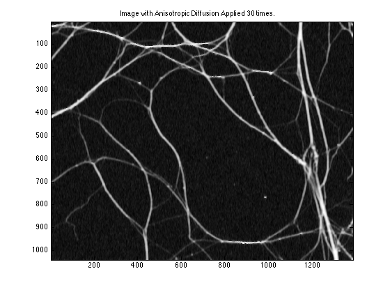

Cleaning Noisy Neurons - Anisotropic Diffusion Demo
======================
### Call up Anisotropic Diffusion for a Good Time on the "Edges"

The Matlab files in this directory demonstrate image filtering performed with Anisotropic Diffusion. Anisotropic diffusion is a beautiful idea introduced by Perona & Malik in 1987. 

You can read up on the math at the [Anisotropic Diffusion on Wikipedia](http://en.wikipedia.org/wiki/Anisotropic_diffusion) link. The concept is simple though. At every pixel location you compute a gradient i.e. the difference between a given pixel and its neighboring pixels. Then you change/filter that pixels value accordingly by taking into account the values in the four directions. 

Anisotropic Diffusion is awesome becuase it lets your remove noise without blurring edges. This is because it filters based on the gradient at the pixel and accounting for the difference in each direction. 

Here are some examples of some neurons that have AWGN noise added to them via Matlab. The noise is removed with an anisotropic diffusion function that can be re-used with the Matlab function `anisotropic_diffusion()` contained in `anisotropic_diffusion.m`.

#### Starting Point: Neuron with AWGN

Next, we simply apply the `anisotropic_diffusion()` algorithm and tweak the values for k and the number of iterations and ta-da the image is cleaned up. 

#### Filtered Image: Minimal Noise and Minimal Blur

You can see that main neuronal structure is unaffected, the noise is gone and there is no severe blurring on the edges. The factor K, diffusion coefficient, has a direct impact on how nicely Anisotropic Diffusion plays with edges.

Clone it. Play with it and clean up your images!
